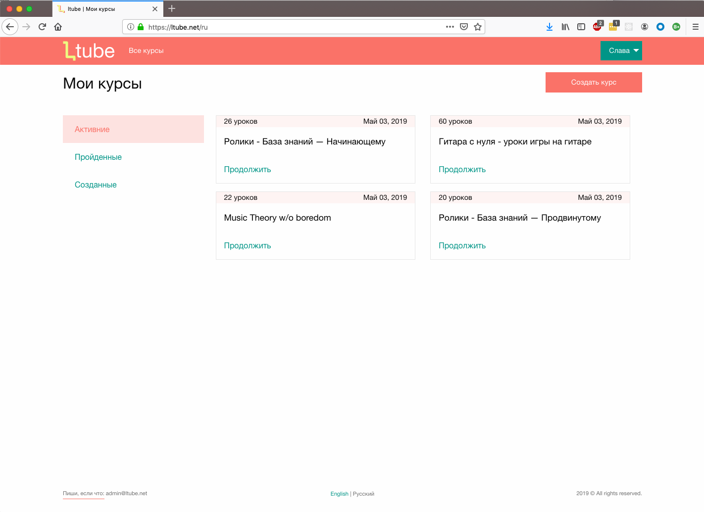

---

title: ltube.net - что это и зачем?
date: "2019-09-03T10:23:00Z"
---

Мне кажется, одна из главных мотивационных сил, которая всегда мной движет - это обучение новым вещам, приобретение и тренировка навыков. Сейчас существует огромное количество различных сервисов типа [Udemy](https://www.udemy.com), [Coursera](https://www.coursera.org/), [edX](https://www.edx.org/) и многих других, которые позволяют обучится почти всему. 

Создать курс на одной из таких площадок - не самое легкое занятие (я даже так, сходу не скажу какие требования для курса на udemy например). А вот, если нужен курс довольно нестандартный, по типу, научись рисовать ногой за два дня :) или, например, скейт, йойо или дайвинг…

У меня довольно часто возникала потребность научиться чему-то быстро и легко. Благо, люди делятся приобретенными навыками и знаниями. Как оказалось, огромный кладезь уроков по чему-либо оказался пам-парам-пам: [YouTube](https://www.youtube.com/).

Вот, например, зимний снежный день и ты такой, а не подрифтить бы тебе на парковке? Первое, что я делаю, иду на youtube и там миллион уроков по дрифту - погнали. Из более реальных кейсов (с дрифтом все +/- так и было :)) - купил я себе ролики, и вот у меня уже 10тищ ютуб видео как кататься новичку.
Потом в ход пошла гитара... Ну, в общем, идея понятна.

В общем, youtube очень выручает, если нужно поучиться, вагон разных видео курсов да еще и с такими направлениями, что не везде найдешь.

Но, ближе к делу. Вот, ты такой учишся йо йо, жонглированию, езде на конях, скейте или электротехнике и у тебя просто тонна видео/плейлистов/каналов, вообщем бардак. Прогресса не видно, где закончил не помнишь (особенно, если это хобби выходного дня), поделиться всем добром тоже не особо, да и быстро вне дома тоже смотреть не удобно.

И тут я такой: “вот бы кароч как-то бы себе все видео собирать в кучу и поделиться с остальными”. Так и появилась идея с [ltube.net](https://ltube.net/).

Коротко как оно работает в моем случае.

Каждый курс состоит из набора уроков, где урок просто видео на youtube + тетрадь, где можно оставлять свои заметки.

Можно либо подписаться на уже готовый курс (кто-то потрудился, собрал видосов и создал публичный курс). Либо создать свой курс, как приватный, так и публичный.

При создании курса просто наполняешь его разными видео из ютуба и заполняешь названия уроков. (Кстати, если все видео с одного плейлиста - там есть парсер, так что можно все разом вставить). Сохраняешь и курс котов.

Хочешь - проходи себе сам, отмечая уроки и помня всегда где остановился. Либо можешь поделиться и сделать курс публичным - тогда его увидят все.

Вот и все. Проект бесплатный, так что если кому такое нужно, то пользуйтесь на здоровье.

