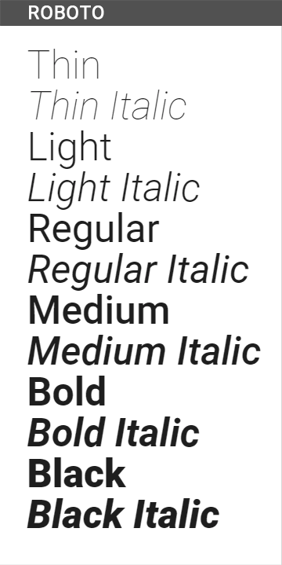
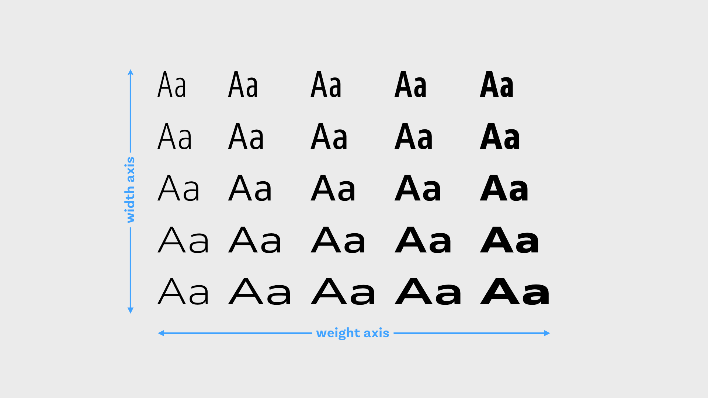

---

title: Variable fonts in the Web
date: "2019-10-21T13:00:00Z"

---

## Into

The year is almost _2020_ but still, the dominant method of getting the information is text. The text consists of symbols and letters (or hieroglyphs). To represent the text on the web we are using fonts (typefaces).

In the early ages of the web, there was impossible to change default fonts on the web page until Netscape introduces the **font** tag in _1995_.

## How does the font represent on the Web?

The font - is a file that contains all possible variations of letters, symbols, hieroglyphs, etc.

Here is an example of how Roboto typeface looks inside.


Every webpage has a default font depending on your web browser and operating system. This means if you don’t specify the exact font for your web application you don’t know for sure how it might look for the end-user.

Besides this, the default font is not always a good choice if you want to increase readability and achieve good aesthetic appeal.

## How to add custom font into the web page?

The simplest way to include font from https://fonts.google.com/. But there are a lot of downsides such as limited variation of fonts and depending on 3d party CDN. So I’m not going to cover this approach.

We will be including the custom font face file. First what you need is to choose between multiple fonts face file formats:

* SVG (yes it could be used as a font)
* EOT - Embedded OpenType
* OTF - OpenType
* TTF - TrueType
* WOFF/WOFF2 - Web Open Font format

Currently, the web moves to WOFF/WOFF2 file types. They are developed especially for the web by Mozilla.

WOFF2 has full browser support (almost except IE).


## You got your font - what next?

After you could include it with font-face property in CSS and you are ready to use it.

```css
@font-face {
  font-family: FontName;
  src: url('path/filename.woff2') format('woff2'),
    url('path/filename.woff') format('woff');
}
```

## Font variants and what this all about.

After you include the font you will start to style your text. Add bold heading, change the font weight, start to emphasize text with italic style.

Here is where are the problems start. For every additional style or the font-weight, you actually need to include a separate typeface file!

Here, for example, all of the variations of Roboto font.



### Variable fonts and how they solve our problems.

To optimize this we have a relatively new technology called - Variable Fonts. It includes all the type variations into a single file!


To use Variable Font first you need to find a typeface you want and then find it variable font version. Typically it with “VF” suffix in the font name (eg. AmstelvarAlpha-VF.woff2).

And that’s it.

You could see how variable font could fix the CSS Awesomes:

https://codepen.io/mandymichael/pen/vYYLByj



This technology has the support of all modern browsers so could be used freely.


## Conclusion.

If your web application has rich typography use of the Variable Fonts is a good choice.

An additional extra would be the animation possibilities that you could apply to the variable font.


Variable fonts play ground:

* https://www.axis-praxis.org
* https://v-fonts.com
